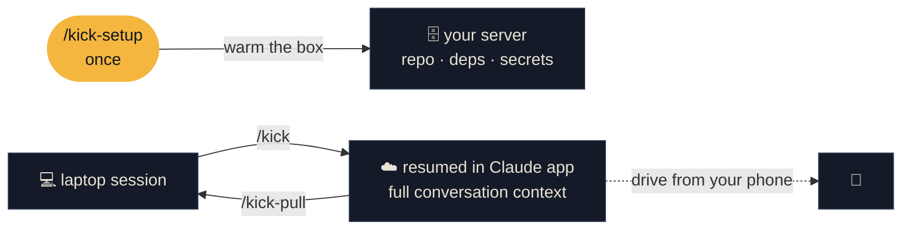

<p align="center">
  
</p>

<p align="center">
  <a href="#-install"></a>
  <a href="#-how-it-works"></a>
</p>

<p align="center">
  
  
  
  
</p>

<p align="center">
  <b>Close the laptop without closing the conversation.</b><br>
  <code>kick</code> hands off the <i>current</i> Claude&nbsp;Code session — working tree, uncommitted changes,
  <i>and the conversation at its exact position</i> — onto your own always-on server,<br>
  resumes it <b>with full context</b> in the Claude app so you can keep going from your phone, then pulls everything home.
</p>

---

## Why

You're deep in a Claude Code session and you have to leave. Anthropic's native cloud teleport drops your uncommitted work, and closing the lid kills the run. `kick` moves the **whole** session — code, *uncommitted* changes, and the chat history — to a box you own, brings it up in the Claude mobile/web app **resumed with the entire conversation**, and lets you bring it back when you're at the keyboard again.

```text
💻  laptop  ──/kick──▶  🗄️  your server  ──drive──▶  📱  phone
        ◀──/kick-pull──  (code + uncommitted + the grown conversation)
```

## ✦ Install

`kick` is a Claude Code **plugin** that ships its own marketplace. In Claude Code:

```bash
/plugin marketplace add https://github.com/israelbls/kick.git
/plugin install kick@kick-tools
```

> Use the full HTTPS URL — the `owner/repo` shorthand clones over SSH and needs a GitHub key in your `known_hosts`. Update later with `/plugin update kick@kick-tools`.

**Requirements**

| Where | Needs |
|---|---|
| Your laptop | `git`, `python3` |
| Your server | an always-on Linux box reachable over SSH · `git`, `bash`, a package manager · logged into Claude once (`claude auth login`) |

## ⌘ The four commands

| Command | When | What it does |
|---|---|---|
| **`/kick-setup`** | once per project | Verifies SSH + remote `claude` login + prerequisites, clones the repo to the server, installs deps, carries secrets, writes a gitignored config. Slow, thorough. `--refresh` for a lighter re-sync. |
| **`/kick`** | leaving the laptop | Ships today's delta (uncommitted diff + transcript), sets workspace trust, and **resumes this exact conversation under Remote Control** so it shows up in the Claude app *with full context*, named `<project> (kicked <time>)`. Fast. `--refresh` re-syncs commits/deps; `--dry-run` previews. |
| **`/kick-pull`** | back at the laptop | Brings the remote's code **and grown conversation** home so the laptop mirrors it, titled `<project> (pulled <time>)` for `/resume`. Stops the remote session. |
| **`/kick-status`** | anytime | Where the baton is, whether the remote advanced, whether you diverged, what a pull would bring. `--json` for scripting. |

## 🛰️ How it works



**The handoff carries three things, intact:**

- 🗂️ **Code** — the repo at your commit, plus a `git bundle` of any commits the laptop made since the last sync.
- ✏️ **Uncommitted changes** — tracked diffs *and* untracked files, applied on top.
- 💬 **The conversation** — the full transcript (subagents, tool-results, tasks) at its exact position, resumed in the app via `claude --remote-control <name> --resume <id>` so you continue *exactly where you left off*.

**The baton.** Each handoff flips an `active_side` and bumps a `generation`, recording a checkpoint (transcript tip, `HEAD`, worktree digest). That's how `pull` and `status` know whether the laptop genuinely diverged — and a clean pull mirrors the remote automatically, no prompts.

## 📱 Attaching from your phone

After `/kick`, open the Claude app → **Code tab** (or [claude.ai/code](https://claude.ai/code)) and pick the session — it's named **`<project> (kicked <date time>)`** so it stands out from your normal cloud sessions. It runs under `tmux`, so it survives the SSH connection closing, and the app resumes **this exact conversation with full context**.

> **One-time per server:** the *first* time, Remote Control must be enabled interactively — SSH in, run `claude remote-control` once, answer `y`, and approve the browser link (a one-time `sessions`-scope OAuth). After that, `/kick` brings it up automatically.

When you're back at the keyboard, `/kick-pull` brings the grown conversation (and any edits made on the phone) home — then `claude --resume <id>` to keep going on the laptop.

## 🧭 `/kick-pull` options

`--dry-run` (preview + verdict, transfers nothing) · `--code-only` / `--convo-only` (partial) · `--keep-remote` (don't stop the remote) · `--fork` (land the cloud session under a new id + branch instead of overwriting) · `--name "<title>"` (name the pulled session).

On a true **code** divergence (you advanced locally *and* on the remote), pull asks you — `remote-wins` / `fork` / `abort` — and **always backs up local work first**: a `refs/kick/pre-pull-*` ref, a `git stash`, and a timestamped transcript copy. (Conversation-only drift from running `/kick` itself is expected and never blocks a pull.)

## 🗃️ Where things live

- **Config:** `<project>/.claude/kick.local.json` — host, user, port, **SSH key by path** (never the key itself), remote project dir, head sha, lockfile hash, secrets policy. Mode `600`, auto-added to `.git/info/exclude`.
- **Remote staging:** `~/.kick-staging/<project>-<sid>/` on the server.
- **Remote session log:** `~/.claude/kick-<sid>.log` on the server.

## 📟 Reading the output

Every script prints machine-readable status lines:

| Marker | Meaning |
|---|---|
| `KICK_OK:` | success |
| `KICK_INFO:` | progress |
| `KICK_ASK:` | needs your decision (SSH auth, `claude auth login`, a version bump) — resolve it, then retry |
| `KICK_ALERT:` | something's off but the run continues degraded |
| `KICK_FATAL:` | aborted; the message says why |

## 🔧 Troubleshooting

- **`no kick config`** → run `/kick-setup` first. `/kick` never sets up.
- **Remote unreachable** → check the box/network; re-run `/kick-setup` if the host changed.
- **Remote not logged into Claude** → SSH in, `claude auth login`, follow the device-code link, retry.
- **Kill a stuck remote session** → `ssh <box> 'tmux kill-session -t <rc-name>'`.
- **See what the remote is doing** → `ssh <box> 'tail -f ~/.claude/kick-<sid>.log'`.
- **Dependencies changed** → `/kick` warns; run `/kick --refresh` to reinstall.

## ⚠️ Known limitations

- Machine-level tools (`ffmpeg`, `psql`, …) are detected and reported, not installed.
- Submodule working trees ship as files; submodule git history doesn't.
- Anthropic native cloud isn't a target (its teleport drops uncommitted work).
- Remote Control needs a one-time interactive enable per server, and `tmux` on the remote (the interactive client needs a pty).
- The app resumes the conversation as a normal `--resume` — it continues from the transcript's last turn, not from a tool call that was mid-execution when you kicked.

---

<p align="center">
  <sub>Built for long-running Claude&nbsp;Code work that shouldn't die when the laptop does.</sub><br>
  <sub><a href="LICENSE">MIT</a> · <code>/plugin marketplace add https://github.com/israelbls/kick.git</code></sub>
</p>
